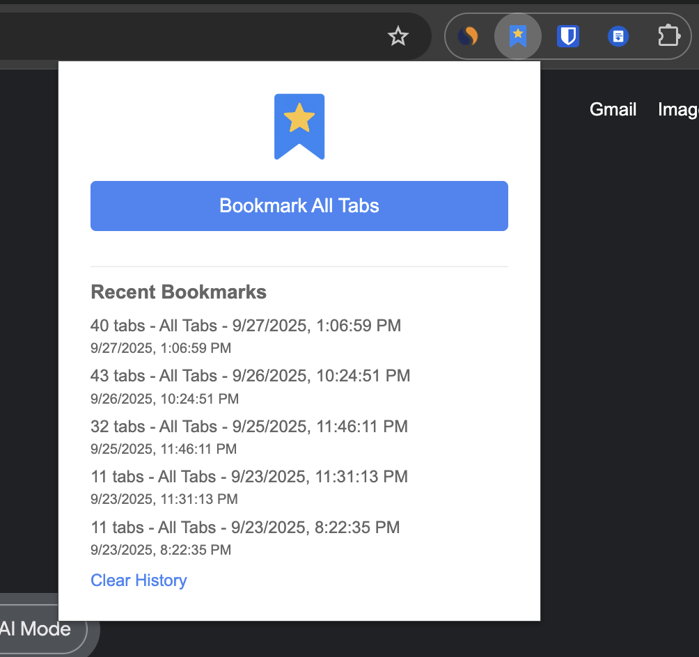
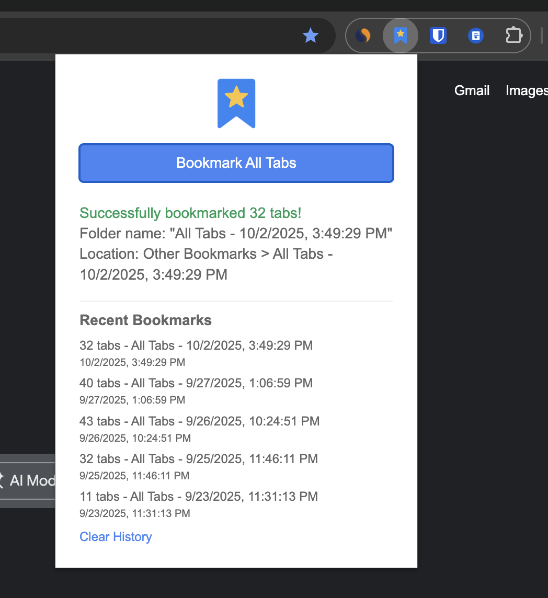
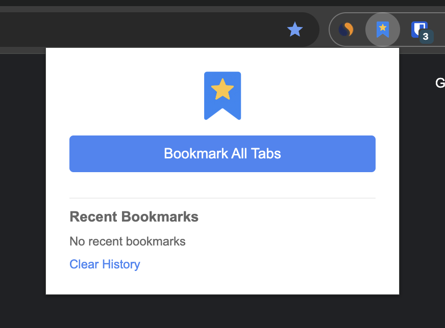

# Bookmark All Tabs

Bookmark All Tabs is a chrome extension to bookmark all open tabs across all Chrome windows with a single click. It is built with Manifest V3 and the Chrome Extensions API. Try it out [here](https://chromewebstore.google.com/detail/bookmark-all-tabs/fhflnhaakgankgheoheakegafhocaolm)! 

---

## How to Use

1. Click the extension icon in the Chrome toolbar.
2. Click "Bookmark All Tabs".
3. The extension creates a new folder (named with the current date/time) containing bookmarks for all non-`chrome://` tabs across all open windows.
4. See confirmation details and your recent activity in the popup.

---

## Installation (Load Unpacked)

1. Clone or download this repository.
2. Open Chrome and navigate to `chrome://extensions/`.
3. Enable "Developer mode" (top right).
4. Click "Load unpacked" and select this project directory.

### Install from Chrome Web Store

If you prefer a one-click install, get it from the Chrome Web Store:

- [Install from Chrome Web Store](https://chromewebstore.google.com/detail/bookmark-all-tabs/fhflnhaakgankgheoheakegafhocaolm)

---

## Technologies Used

This extension is built using **Manifest V3**, the latest Chrome extension standard. It leverages the **Chrome Extensions API** including the `bookmarks`, `tabs`, `storage`, and `windows` APIs for core functionality. The frontend is implemented with **vanilla JavaScript, HTML, and CSS** for a lightweight, fast user experience.

---

## Permissions & Privacy

This extension operates entirely locally in your browser and does not send data to external servers.

Required permissions:

- `bookmarks`: Create and organize bookmarks of your tabs
- `tabs`: Read open tab metadata (title and URL)
- `storage`: Store a small, local history of your recent bookmark actions

---

## License

MIT License